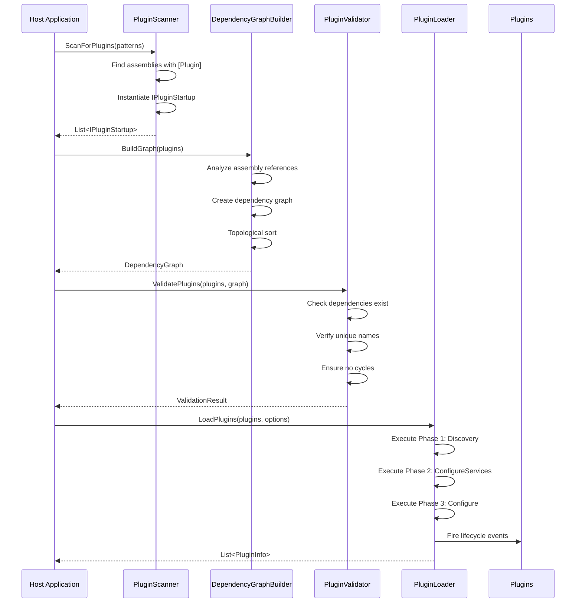
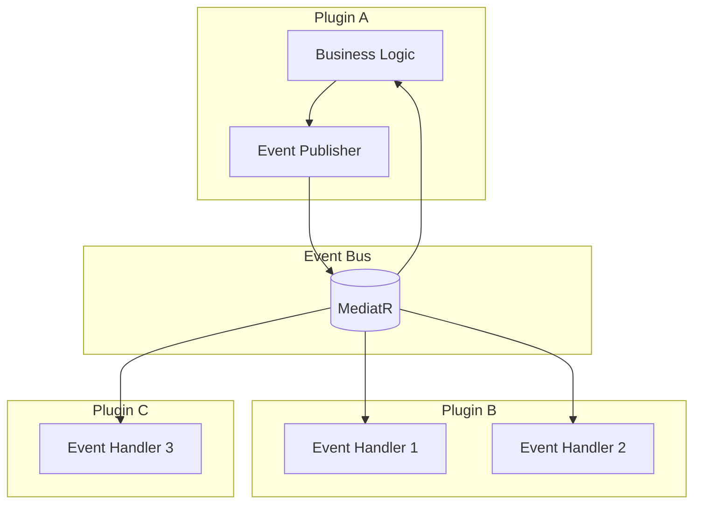
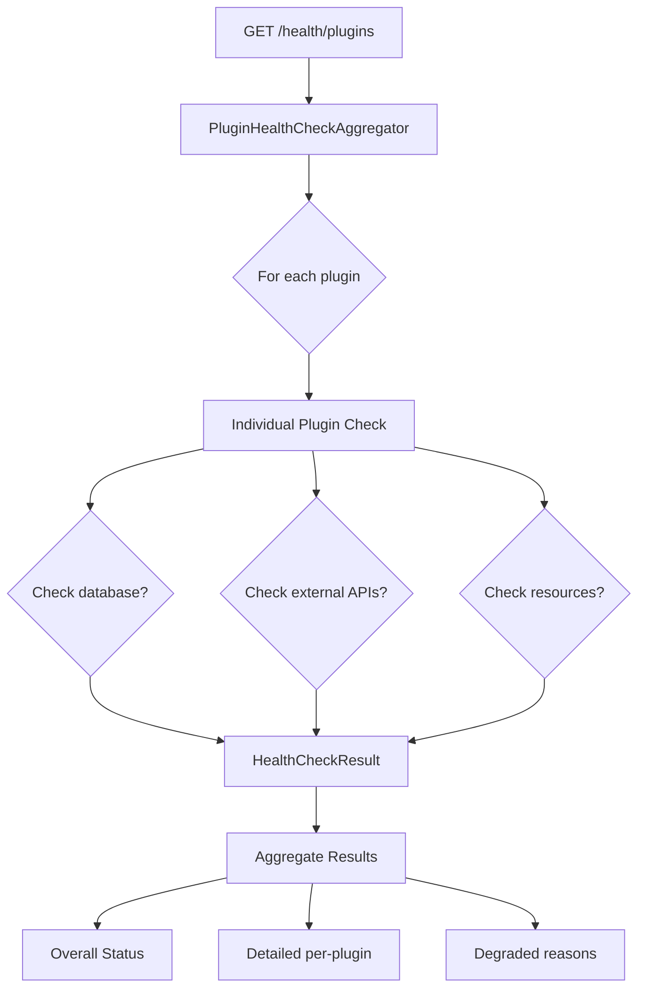

# System Patterns

## Architecture Overview

### Core Architecture Pattern: Three-Phase Plugin Loading

The plugin system uses a carefully orchestrated three-phase initialization to ensure correct ordering and dependency resolution:

```csharp
// Phase 1: Discovery & Loading
var plugins = await _pluginScanner.ScanForPlugins(options);

// Phase 2: Service Registration
var serviceCollection = ConfigureServices(hostServices, plugins);

// Phase 3: Middleware Pipeline
Configure(webApplication, plugins);
```

#### Phase 1: Discovery & Loading
**Purpose:** Find and validate plugins

**Steps:**
1. Scan assemblies for `[Plugin]` attribute
2. Instantiate `IPluginStartup` implementations  
3. Build dependency graph via assembly references
4. Perform topological sorting
5. Validate no circular dependencies

**Pattern Used:** Builder Pattern for dependency graph construction

#### Phase 2: Service Registration  
**Purpose:** Register services in priority order

**Steps:**
1. Sort plugins by `ConfigureServicesPriority` (lowest first)
2. Call `ConfigureServices()` for each plugin
3. Build final `IServiceProvider`

**Pattern Used:** Priority-based ordering with DI container population

#### Phase 3: Configure
**Purpose:** Setup middleware pipeline in priority order

**Steps:**  
1. Sort plugins by `ConfigurePriority` (lowest first)
2. Call `Configure()` for each plugin
3. Publish `ApplicationStartedEvent`

**Pattern Used:** Pipeline configuration with priority ordering

### Key Architectural Decisions

#### 1. Host as Infrastructure Shell
- **Host Provides:** DI, Configuration, Logging, Event Bus
- **Plugins Provide:** Business Logic, Middleware, Services
- **Rationale:** Clean separation, independent testing, modular deployment

#### 2. Convention over Configuration
- Auto-discovery via `[Plugin]` attribute
- Sensible defaults for priorities, naming, versions
- Metadata derived from assemblies
- **Rationale:** Reduced boilerplate, faster development

#### 3. Compile-Time Dependencies
- Plugin dependencies via project references
- Build-time validation of dependencies
- MSBuild resolves version conflicts
- **Rationale:** Early error detection, type safety, performance

#### 4. Event-Driven Communication
- MediatR-based publisher/subscriber pattern
- Shared event contracts via separate projects
- **Rationale:** Loose coupling, scalable communication, testability

## Design Patterns Used

### Builder Pattern: Dependency Graph Construction

```csharp
public class DependencyGraphBuilder
{
    public DependencyGraph BuildGraph(List<IPluginStartup> plugins)
    {
        var graph = new DependencyGraph();
        
        foreach (var plugin in plugins)
        {
            AddPluginToGraph(graph, plugin);
            AddDependenciesToGraph(graph, plugin);
        }
        
        return graph;
    }
    
    // Implementation details...
}
```

**Why Builder Pattern:**
- Complex construction logic
- Immutable result (DependencyGraph)
- Validation during building
- Clear separation of concerns

### Strategy Pattern: Plugin Scanning

```csharp
public interface IPluginScanner
{
    Task<List<IPluginStartup>> ScanForPlugins(PluginSystemOptions options);
}

public class AssemblyScanningPluginScanner : IPluginScanner
{
    public async Task<List<IPluginStartup>> ScanForPlugins(PluginSystemOptions options)
    {
        // Scan loaded assemblies
        // Find [Plugin] attributes
        // Instantiate and validate plugins
    }
}

// Potential future implementations:
// public class ReflectionScanningPluginScanner : IPluginScanner
// public class ConfigurationBasedPluginScanner : IPluginScanner
```

**Why Strategy Pattern:**
- Multiple scanning strategies possible
- Interface allows testing with mocks
- Algorithm can evolve independently

### Mediator Pattern: Event-Based Communication

```csharp
// Event publishing (Mediator)
await _eventPublisher.Publish(new CustomerCreatedEvent { ... });

// Event handling (Colleague)
public class OrderCreatedHandler : IEventSubscriber<CustomerCreatedEvent>
{
    public async Task Handle(CustomerCreatedEvent domainEvent, CancellationToken ct)
    {
        // Handle event without direct coupling
    }
}
```

**Why Mediator Pattern:**
- Decouples event publishers from subscribers
- Centralized communication management
- Easy to add new event handlers
- Cross-cutting concerns (logging, validation)

### Factory Pattern: Plugin Lifecycle Management

```csharp
public interface IPluginFactory
{
    PluginInstance Create(IPluginStartup startup);
    Task LoadAsync(PluginInstance instance);
    Task ConfigureServicesAsync(PluginInstance instance, IServiceCollection services);
    Task ConfigureAsync(PluginInstance instance, IApplicationBuilder app);
}

// Usage:
var plugin = await _pluginFactory.Create(startup);
await _pluginFactory.LoadAsync(plugin);
await _pluginFactory.ConfigureServicesAsync(plugin, services);
await _pluginFactory.ConfigureAsync(plugin, app);
```

**Why Factory Pattern:**
- Complex object creation and lifecycle
- Consistent plugin initialization
- Error handling isolation
- Future extensibility

### Observer Pattern: Health Check Aggregation

```csharp
public class PluginHealthCheckAggregator : IHealthCheck
{
    private readonly IEnumerable<IPluginHealthCheck> _pluginChecks;
    
    public async Task<HealthCheckResult> CheckHealthAsync(HealthCheckContext context, CancellationToken ct)
    {
        var results = new List<HealthCheckResult>();
        
        foreach (var check in _pluginChecks)
        {
            results.Add(await check.CheckHealthAsync(context, ct));
        }
        
        return AggregateResults(results);
    }
}
```

**Why Observer Pattern:**
- Subscription model for health checks
- Loose coupling between aggregator and individual checks
- Easy to add/remove plugin health checks
- Aggregation logic centralized

## Component Relationships

### Plugin Loading Sequence Diagram



### Plugin Communication Flow



### Health Check Architecture



## Data Flow Patterns

### Configuration Data Flow

```csharp
// Host appsettings.json structure
{
  "Plugins": {                              // Root plugins section
    "CRM": {                               // Plugin-specific section
      "ConnectionString": "...",
      "Features": {
        "Notifications": true
      }
    },
    "Inventory": {
      "Cache": {
        "Enabled": false,
        "TtlMinutes": 30
      }
    }
  }
}

// Configuration flow:
Host Configuration (IConfigurationRoot)
    ↓ Bind "Plugins:CRM" section
Plugin CRM Settings (CRMSettings)
    ↓ Register in DI
IPluginStartup.ConfigureServices(IServiceCollection, IConfiguration)
    ↓ Scoped plugin configuration injected
Plugin Services (CRMService: CRMSettings)
```

### Event Data Flow

```csharp
// Event publishing flow:
1. Business operation triggers event
2. Plugin creates event instance with data
3. EventPublisher.Publish(event)
4. MediatR routes to registered handlers
5. Handlers process asynchronously
6. Optional: Event context/tracing correlation
7. Results logged and monitored
```

### Logging Data Flow

```csharp
// Structured logging pattern:
_logger.LogInformation(
    "Plugin {PluginName} configured in {Duration}ms", 
    plugin.Name, 
    stopwatch.ElapsedMilliseconds);

// Log enrichment:
ILogger logger with PluginContext
    ↓ Structured fields (PluginName, PluginVersion, OperationId)
Plugin operations automatically tagged
    ↓ Centralized logging aggregation
Production monitoring and alerting
```

## Error Handling Patterns

### Graceful Degradation Pattern

```csharp
public async Task LoadPlugins(PluginSystemOptions options)
{
    var results = new List<PluginInfo>();
    
    foreach (var plugin in plugins)
    {
        try
        {
            await LoadSinglePlugin(plugin);
            results.Add(PluginInfo.Success(plugin));
        }
        catch (Exception ex)
        {
            _logger.LogError(ex, "Plugin {PluginName} failed to load", plugin.Name);
            
            if (options.IgnoreErrors)
            {
                results.Add(PluginInfo.Failed(plugin, ex));
            }
            else
            {
                throw new PluginLoadingException($"Plugin loading failed: {plugin.Name}", ex);
            }
        }
    }
    
    return results;
}
```

**Pattern Benefits:**
- System remains available if individual plugins fail
- Detailed error information preserved
- Configurable failure behavior
- Proper logging for monitoring

### Circuit Breaker Pattern (Future Enhancement)

```csharp
// Potential future: Protect against repeated plugin failures
public class PluginCircuitBreaker
{
    public async Task<T> ExecuteWithCircuitBreaker<T>(
        Func<Task<T>> operation, 
        string pluginName)
    {
        if (IsCircuitOpen(pluginName))
        {
            throw new CircuitBreakerOpenException();
        }
        
        try
        {
            var result = await operation();
            RecordSuccess(pluginName);
            return result;
        }
        catch (Exception ex)
        {
            RecordFailure(pluginName);
            throw;
        }
    }
}
```

## Security Patterns

### API Gateway Pattern

**Host provides controlled interfaces:**

```csharp
// Plugin has access through DI
public class MyPluginService
{
    public MyPluginService(
        IEventPublisher eventPublisher,           // ✓ Publishing events allowed  
        IEmailSender emailSender,                 // ✓ Sending email allowed
        ILogger<MyPluginService> logger,          // ✓ Logging allowed
        IConfiguration configuration)             // ✓ Own config allowed
    {
        // Constructor injection provides controlled access
    }
}

// Host controls what plugins can access
builder.Services.AddSingleton<IEmailSender, SmtpEmailSender>();
builder.Services.AddSingleton<IEventPublisher, EventPublisher>();
builder.Services.AddScoped<ILogger, PluginLogger>();
```

**Benefits:**
- No direct coupling to host internals
- Testable with mocks
- Security boundaries enforced by interfaces
- Future implementation changes don't break plugins

### Configuration Scoping Pattern

```csharp
// Plugin receives scoped configuration
public void ConfigureServices(IServiceCollection services, IConfiguration configuration)
{
    // 'configuration' is already scoped to "Plugins:ThisPluginName"
    services.Configure<MySettings>(configuration);
    
    // Plugin cannot access other plugin settings
    // var otherPluginSetting = configuration["OtherPlugin:Secret"]; // ❌ Not accessible
}
```

## Testing Patterns

### Plugin Testing Isolation

```csharp
public class PluginIntegrationTests : IClassFixture<PluginTestFixture>
{
    private readonly PluginTestFixture _fixture;
    
    // Each test gets isolated DI container with just this plugin
    public void ConfigureServices(IServiceCollection services, IConfiguration config)
    {
        // Register mock infrastructure services
        services.AddSingleton<IEventPublisher, MockEventPublisher>();
        services.AddSingleton<IEmailSender, MockEmailSender>();
        
        // Register actual plugin
        new MyPluginStartup().ConfigureServices(services, config);
    }
}
```

### Event Handler Testing

```csharp
public class EventHandlerTests
{
    [Fact]
    public async Task Handle_OrderCreatedEvent_CreatesInvoice()
    {
        // Arrange
        var mockInvoiceService = new Mock<IInvoiceService>();
        var handler = new OrderCreatedEventHandler(mockInvoiceService.Object);
        var domainEvent = new OrderCreatedEvent { OrderId = 123 };
        
        // Act
        await handler.Handle(domainEvent, CancellationToken.None);
        
        // Assert
        mockInvoiceService.Verify(x => 
            x.CreateInvoice(domainEvent.OrderId), 
            Times.Once);
    }
}
```

## Performance Patterns

### Lazy Initialization Pattern

```csharp
public class LazyPluginResources
{
    private readonly Lazy<Task<ExpensiveResource>> _resource;
    
    public LazyPluginResources(IPluginDependency dependency)
    {
        _resource = new Lazy<Task<ExpensiveResource>>(() => 
            dependency.CreateExpensiveResourceAsync());
    }
    
    public async Task<ExpensiveResource> GetResource()
    {
        return await _resource.Value;
    }
}
```

**Usage in Plugin:**
- Resource initialization deferred until first access
- Concurrent access handled gracefully
- Memory usage optimized for unused plugins

### Asynchronous Processing Pattern

```csharp
public class AsyncEventProcessor : IEventSubscriber<DomainEvent>
{
    private readonly SemaphoreSlim _processingLock = new SemaphoreSlim(1, 1);
    
    public async Task Handle(DomainEvent domainEvent, CancellationToken ct)
    {
        await _processingLock.WaitAsync(ct);
        
        try
        {
            // Process event with proper concurrency control
            await ProcessEventCore(domainEvent, ct);
        }
        finally
        {
            _processingLock.Release();
        }
    }
}
```

**Benefits:**
- Controlled concurrency per event type
- Prevents duplicate processing
- Configurable throughput limits
- Resource usage protection

### Caching Pattern

```csharp
public class PluginCache<T>
{
    private readonly IMemoryCache _cache;
    private readonly TimeSpan _defaultTtl;
    
    public async Task<T> GetOrCreate(
        string key, 
        Func<Task<T>> factory, 
        TimeSpan? ttl = null)
    {
        if (!_cache.TryGetValue(key, out T cached))
        {
            cached = await factory();
            _cache.Set(key, cached, ttl ?? _defaultTtl);
        }
        
        return cached;
    }
}
```

**Plugin Usage:**
- Cache expensive computations
- Share data between plugin operations
- Configurable TTL per cache entry
- Memory management awareness
